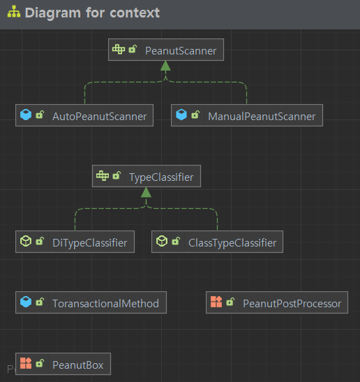

# Peanut Box

> 땅콩박스

- [README로 가기](../README.md)

Spring IoC 컨테이너를 모방하여 만들었다.

자동 등록과 수동 등록 모두 지원되며 DI를 등록하는 대상에 DI가 걸려있는 경우에 대해서도 등록이 가능하다.

| 항목             | Spring Bean Container | 땅콩 박스                |
|----------------|-----------------------|----------------------|
| 컨테이너           | Bean Container        | Peanut Box           |
| 자동 등록 어노테이션    | @Component            | @ImPeanut            |
| 수동 등록 설정 어노테이션 | @Configuration        | @PeanutConfiguration |
| 수동 등록 어노테이션    | @Bean                 | @ThisIsPeanut        |
| DI 주입 어노테이션    | @Autowired            | @GiveMePeanut        |

# 복합 DI 테스트 케이스 

- 생성자 필드 DI, 수동 등록 등의 경우를 포함하여 테스트 케이스를 설계하여 확인하였습니다.

- [테스트 코드](../mvc/src/test/java/nextstep/context/PeanutBoxTest.java)

```java
@Test
void getPeanut_3() {
    PeanutBox.INSTANCE.init("nextstep.context.test_case_3");
    assertAll(
            () -> assert_peanut_contains(TC3_Layer_1.class),
            () -> assert_peanut_contains(TC3_Layer_2_1.class),
            () -> assert_peanut_contains(TC3_Layer_2_2.class),
            () -> assert_peanut_contains(TC3_Layer_3_1.class),
            () -> assert_peanut_contains(TC3_Layer_3_2.class),
            () -> assert_peanut_contains(TC3_Layer_3_3.class),
            () -> assert_peanut_contains(TC3_Layer_4.class)
    );
}
```

### 구동 메카니즘




땅콩 박스는 땅콩을 등록시 ManualPeanutScanner 로 수동 등록하고 AutoPeanutScanner를 이용하여 자동등록합니다.
이 자동 등록의 경우가 DFS로 구현이 되어 있습니다. 

```java

```


# 사용 예시

### 땅콩 수동 등록

```java
@PeanutConfiguration
public class PeanutConfig {

    @ThisIsPeanut
    public ObjectMapper objectMapper() {
        return new ObjectMapper();
    }
}
```

```java
@Controller
public class UserController {

    // 등록한 땅콩을 생성자 자동 주입
    private final ObjectMapper objectMapper;

    public UserController(final ObjectMapper objectMapper) {
        this.objectMapper = objectMapper;
    }
    ...
```

### Layer Architecture 에서 활용

@Controller, @Service 어노테이션에는 `@Peanut` 이 있으며 땅콩으로 등록이 가능하다.

```java
@Target({ElementType.TYPE})
@Retention(RetentionPolicy.RUNTIME)
@ImPeanut
public @interface Controller {
    String value() default "";

    String path() default "";
}
```

```java
@Controller
public class LoginController {

    private final LoginService loginService;

    public LoginController(final LoginService loginService) {
        this.loginService = loginService;
    }
```

- 아래와 같이 필드 DI 지원.

```java
@Service
public class LoginService {

    @GiveMePeanut
    private InMemoryUserRepository userRepository;

    ...
```

```java
@Repository
public class InMemoryUserRepository { // DB를 모방한 Repository

    private final Map<String, User> database = new ConcurrentHashMap<>();
```

